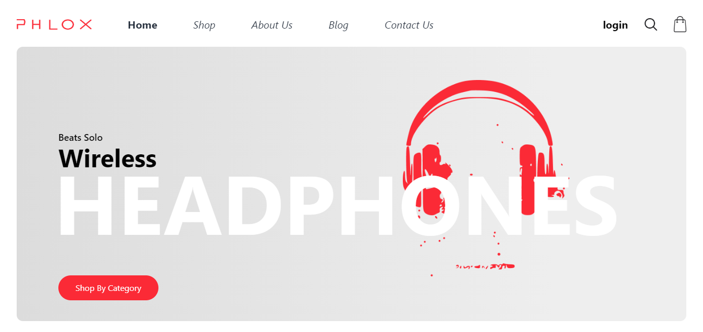

# PHLOX
[](https://phlox-psi.vercel.app/)

## Sobre ✏️
  ### A PHLOX é um e-commerce que vende os mais diversos acessórios do mundo moderno, desde de simples cabos auxiliares, até consoles de útima geração.

## Estado do projeto 🚧
    Completo ✔️ => Landing page principal da loja (Home), onde os clientes tem o primeiro contato com a loja on-line.
    Em progresso 👨‍💻 => Trabalhando no layout de exibição dos produtos (Shop).
    Responsivo 📲 => Tela principal adaptada para diversos dispositivos.

## Tecnologias 💻
  <div>
    <abbr title="React">
      
    </abbr>
    <abbr title="Typescript">
      
    </abbr>
  </div>

## Bibliotecas
  <div>
    <abbr title="Tailwind CSS">
      
    </abbr>

## Rodando Localmente (Prompt)
### Clone o projeto
```bash
  git clone https://github.com/Paulo-Mikhael/phlox
```
### Entre no diretório do projeto
```bash
  cd my-project
```
### Instale as dependências
```bash
  npm install
```
### Inicie o servidor
```bash
  npm run dev
```
## Talvez você queira ver 💡
  ### [Portifólio](https://paulo-mikhael.github.io/Portifolio)
  ### [Currículo (png, jpg ou pdf)](https://drive.google.com/drive/folders/1ER7n3GHZmokEsQJkf6yFAG3E0dC1oLfq?usp=drive_link)

## Confira meus outros projetos 🛠️
  - [XWriter - Poste seus momentos](https://xwriter.vercel.app)
  - [Fastask - Gerenciador de Tarefas](https://paulo-mikhael.github.io/fastask)
  - [Landing Page para uma academia](https://paulo-mikhael.github.io/academia-landing-page)
  - [Landing Page para um e-commerce de plantas](https://casa-verde-pink-phi.vercel.app/)
  - [[Clone] Pagina da Unity](https://paulo-mikhael.github.io/pagina-unity-2024)
  - [[Clone] Pagina do Gartic](https://paulo-mikhael.github.io/pagina-gartic-2024)

## Contatos
  [](https://paulo-mikhael.github.io/Portifolio/Pages/contacts/)
  [](https://www.linkedin.com/in/paulo-miguel-4b706022b/)
  [](https://www.instagram.com/pa__miguel?igsh=MWxoYzdqNGluZWcyaA%3D%3D)
  [](https://api.whatsapp.com/send/?phone=5592992813253&text=Ol%C3%A1%21+Gostaria+de+fazer+uma+oferta...&type=phone_number&app_absent=0)